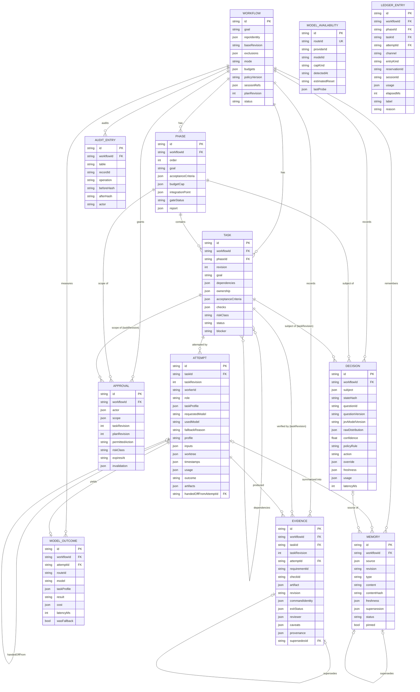

# Persistent records

**Status:** Stage 1 spec (issue #12). Types live in [`src/storage/records.ts`](../src/storage/records.ts);
this document explains identity, versioning, revision/invalidation rules, mutability, and
foreign keys. **Design authority:** PLAN §5 (Records), §2.2, §3.B (provenance), §3.F
(evidence), §3.H (memory). The state transitions and approval-invalidation rules (#13), gate formulas (#14),
approval classes (#15), and the SQLite store (#23) build on this file.

Schema version: `RECORDS_SCHEMA_VERSION = 1`. (#125 re-keyed `ModelAvailability` and
`ModelOutcome` on `routeId` while still at version 1: no SQLite store (#23) and no release
had shipped, so no row exists to migrate. The first store migration starts from this shape.)

## 1. Common envelope

Every record carries:

| Field | Type | Meaning |
|---|---|---|
| `id` | branded string | Stable, opaque, never reused, never encodes meaning. |
| `createdAt` | ISO-8601 UTC | Set once on insert. |
| `updatedAt` | ISO-8601 UTC | Moves on every write of a mutable record. **Pinned to `createdAt`** for append-only records. |
| `schemaVersion` | `1` | Version the row was written under; migrations bump it. |
| `kind` | `"mutable"` \| `"append_only"` | Discriminator used by `UpdatePatch<T>` (§4). |

Timestamps are strings so ordering is lexicographic and the store never depends on host
locale. Git revisions are full 40-hex SHAs. Paths are always repository- or
artifact-directory-relative — no machine-specific absolute paths are ever persisted.

## 2. ER diagram

`MODEL_AVAILABILITY` is global (one row per **route**), not workflow-scoped: a quota cap
applies to the account that hit it regardless of which workflow did so. A route is one Pi
provider entry plus one model id (`routeId`, issue #125, PRD §3.4): the same model id
configured under two providers — two subscriptions to one vendor — is two routes with
independent caps, health and outcome history. Model cards stay per model id.
`routeId` is derived by `src/models/route.ts`; the rename rule is in
`docs/adr/0011-route-identity.md`.

## 3. PLAN §5 field coverage

Each PLAN §5 field maps to a property on the interface. Names are camelCased; compound
PLAN fields ("task/plan revision", "raw distribution and confidence") map to more than one
property.

| Record | PLAN §5 field → property |
|---|---|
| Workflow | goal → `goal`; repo identity → `repoIdentity`; base revision → `baseRevision`; exclusions → `exclusions`; mode → `mode`; budgets → `budgets`; policy version → `policyVersion`; session refs → `sessionRefs`. Extra: `planRevision`, `status`. |
| Phase | id → `id`; order → `order`; goal → `goal`; acceptance criteria → `acceptanceCriteria`; budget cap → `budgetCap`; integration point → `integrationPoint`; gate status → `gateStatus`; report → `report`. |
| Task | stable id → `id`; revision → `revision`; phase → `phaseId`; goal → `goal`; dependencies → `dependencies`; ownership → `ownership`; acceptance criteria → `acceptanceCriteria`; checks → `checks`; risk class → `riskClass`; status → `status`. Extra: `blocker`. |
| Attempt | worker id → `workerId`; task profile → `taskProfile`; requested model → `requestedModel`; used model → `usedModel`; fallback reason → `fallbackReason`; profile → `profile`; inputs → `inputs`; worktree → `worktree`; timestamps → `timestamps`; usage → `usage`; outcome → `outcome`; artifacts → `artifacts`. Extra: `taskRevision`, `role`, `handedOffFromAttemptId`. |
| Decision | state hash → `stateHash`; question version → `questionId` + `questionVersion`; Jev model version → `jevModelVersion`; raw distribution and confidence → `rawDistribution` + `confidence`; policy rule → `policyRule`; action → `action`; override → `override`; freshness → `freshness`. Extra: `subject`, `usage`, `latencyMs`. |
| Evidence | requirement/check id → `requirementId` + `checkId`; artifact → `artifact`; revision → `revision`; command identity → `commandIdentity`; exit status → `exitStatus`; reviewer → `reviewer`; caveats → `caveats`. Extra (PLAN §3.B): `provenance`; plus `taskRevision`, `supersedesId`. |
| Approval | actor → `actor`; scope → `scope`; task/plan revision → `taskRevision` + `planRevision`; permitted action → `permittedAction`; expiry → `expiresAt`; invalidation → `invalidation`. Extra: `riskClass`. |
| Memory | source → `source`; revision → `revision`; type → `type`; freshness → `freshness`; supersession → `supersession`; status → `status`. Extra (PLAN §3.B/§3.H): provenance inside `source`, `content`, `contentHash`, `pinned`. |
| ModelAvailability | model id → `routeId` (+ `providerId`, `modelId` components; #125); cap kind → `capKind`; detected at → `detectedAt`; estimated reset → `estimatedReset`; last probe → `lastProbe`. |
| ModelOutcome | model → `model` and `routeId` (#125); task profile → `taskProfile`; result → `result`; cost → `cost`; latency → `latencyMs`. Extra: `attemptId`, `wasFallback`. |
| LedgerEntry (#30) | PLAN §2.6 budget caps and §3.I "actual/estimated/unknown cost": scope → `scope`; channel → `channel`; reservation/settlement → `entryKind` + `reservationId`; usage → `usage` (`Usage`, carrying `costBasis`); latency → `elapsedMs`. Extra: `sessionId`, `label`, `reason`. |

`AuditEntry` is the PLAN §5 "append-only audit table"; it is not a PLAN §5 record but is
defined here because the mutability rules in §4 depend on it.

The compile-time test `test/storage/records.types.test.ts` asserts every property in this
table exists on the corresponding interface.

## 4. Mutability: append-only vs mutable

| Table | Kind | Update path |
|---|---|---|
| `workflow` | mutable | `UpdatePatch<Workflow>` |
| `phase` | mutable | `UpdatePatch<Phase>` |
| `task` | mutable | `UpdatePatch<Task>`; see revision rule §5 |
| `attempt` | mutable while `outcome === null`; frozen afterwards (store rejects patches) | `UpdatePatch<Attempt>` |
| `approval` | mutable in **one** field | `ApprovalPatch` — `invalidation`, `null → non-null` only |
| `memory` | mutable | `UpdatePatch<Memory>` — `status`, `supersession`, `freshness.lastValidatedAt` |
| `model_availability` | mutable (upsert by `routeId`) | `UpdatePatch<ModelAvailability>` |
| `decision` | **append-only** | none — `UpdatePatch<Decision>` is `never` |
| `evidence` | **append-only** | none — `UpdatePatch<Evidence>` is `never` |
| `model_outcome` | **append-only** | none — `UpdatePatch<ModelOutcome>` is `never` |
| `ledger_entry` | **append-only** | none — `UpdatePatch<LedgerEntry>` is `never` |
| `audit_entry` | **append-only** | none — `UpdatePatch<AuditEntry>` is `never` |

How "no update path" is expressed in the type design:

1. Append-only interfaces extend `AppendOnlyRecord`, whose `kind` is the literal
   `"append_only"`. Every property is `readonly`.
2. The only generic update type, `UpdatePatch<T>`, resolves to `never` when `T` extends
   `AppendOnlyRecord`. A store method typed `update<T>(id, patch: UpdatePatch<T>)` cannot
   be called for these tables — there is no value of type `never`.
3. `AppendOnlyTable` is *derived* from the interfaces, not hand-listed; the
   `APPEND_ONLY_TABLES` constant is checked with `satisfies` against it, so adding an
   append-only record without marking it fails to compile.
4. `updatedAt` is pinned to `createdAt`, so no consumer can observe an in-place change.
5. Corrections are new rows: `Evidence.supersedesId` and a new `Decision` with a new
   `stateHash`. Nothing is deleted; invalidated evidence stays on disk (PLAN §3.H "without
   deleting original evidence").

The SQLite migration (#23) must create no `UPDATE`/`DELETE` statements for these tables and
may add triggers that `RAISE(ABORT)` on them.

**Implemented in #23.** Both lines of defence exist:

- `src/storage/repos/index.ts` gives the four append-only tables an `AppendOnlyRepository`,
  a class that has no `update` or `delete` method at all. Nothing needs to be passed a
  `never`: the method is absent.
- `migrations/0001-initial.sql` adds `BEFORE UPDATE` and `BEFORE DELETE` triggers that
  `RAISE(ABORT, '<table> is append-only')`, so a statement from *any* connection is
  rejected — including a repair script or a future daemon.

The store-side halves of the mutable rules are implemented in the same place:
`TaskRepository` enforces the §5.1 revision rule, `AttemptRepository` freezes a row once
`outcome` is non-null, and `ApprovalRepository` accepts a patch to `invalidation` only,
and only from `null`. Each is covered by `test/unit/storage/record-rules.test.ts`.

## 5. Identity and revision rules

### 5.1 Task revision

- `Task.id` is stable for the life of the workflow. Replanning that changes what a task
  *is* keeps the id and bumps the revision; a genuinely new piece of work gets a new id.
- `Task.revision` starts at `1` and increments on **any** change to the fields in
  `TASK_REVISIONED_FIELDS`: `goal`, `acceptanceCriteria`, `checks`. These are the fields
  that define what "done" means.
- Changes to `status`, `blocker`, `dependencies`, `ownership`, `riskClass` do **not** bump
  the revision. (`riskClass` changes are handled by approval-class policy in #15, which may
  require re-approval by rule rather than by revision.)
- The store enforces this: a patch touching a revisioned field without `revision === current + 1`
  is rejected; a patch touching only non-revisioned fields with a changed `revision` is
  rejected.

### 5.2 Plan revision

- `Workflow.planRevision` increments when phases or tasks are added, removed, or
  reordered, or when `exclusions` change. Approvals with `scope.kind` of `plan` or
  `workflow` are pinned to it.

### 5.3 What references a revision

| Record | Field | Meaning |
|---|---|---|
| `Attempt` | `taskRevision` | Revision the worker was briefed on. An attempt against an older revision cannot produce evidence for the current one. |
| `Evidence` | `taskRevision`, `revision` (Git SHA) | The check definition came from `taskRevision`; the command ran at Git `revision`. |
| `Decision` | `subject.taskRevision`, `freshness.revision` | The state hash covers both; a bump changes the hash and forces a fresh decision. |
| `Approval` | `taskRevision`, `planRevision` | See §6. |
| `Memory` | `revision` | Git revision the entry was true at; used for staleness. |

## 6. Approval invalidation

An `Approval` references `(taskId, taskRevision)` through `scope.taskId` and
`taskRevision`, plus `Workflow.planRevision` through `planRevision`. It is usable only
when **all** hold:

1. `invalidation === null`.
2. `expiresAt === null` or `expiresAt > now`.
3. `planRevision === Workflow.planRevision`.
4. If `scope.kind === "task"`: the task exists and `taskRevision === Task.revision`.

`approvalInvalidReason(approval, current)` implements exactly this and returns the first
failing reason (`task_revision_changed`, `plan_revision_changed`, `expired`, or the stored
`invalidation.reason`). It is pure — the caller passes `now` — so it is replayable.

When the store bumps `Task.revision` or `Workflow.planRevision`, it writes
`invalidation = { reason: "task_revision_changed" | "plan_revision_changed", at, detail }`
on every affected approval in the same transaction. This is the **only** write permitted on
an approval after insert, and it only goes `null → non-null`; an approval can never be
reactivated. A new approval must be granted against the new revision by an actor — never
inferred from a Jev score (PLAN §3.A).

The transition contract in [state-machine.md](state-machine.md) (#13) additionally
requires `mode_changed` and `policy_version_changed`: on either workflow field change,
the engine atomically invalidates affected approvals and applies the documented
blocked/paused state effects. The helper above sees the stored invalidation; it does
not detect mode/policy changes itself. The new grant must follow the current policy.

Other invalidation reasons: `consumed` (single-use action performed), `revoked` (actor
withdrew it), `session_reconciled` (fork/resume found the repo or plan state no longer
matches — PLAN §5 "never resurrects obsolete approvals").

## 7. Evidence invalidation

Evidence is never edited. It is *considered* invalid when either:

- `Evidence.taskRevision !== Task.revision` (the criteria or checks changed), or
- the repository changed under the task's `ownership` since `Evidence.revision` (detected
  by comparing revisions in code, PLAN §3.F "evidence invalidated after relevant changes").

Re-verification writes a new `Evidence` row with `supersedesId` pointing at the old one.
The task gate (#14) only counts evidence whose `taskRevision` matches and whose Git
revision is current; flaky/missing/unavailable results are explicit `exitStatus` variants
and never count as success.

## 8. Provenance (PLAN §3.B)

`Provenance` carries `revision`, `path`, `range`, `retrievalMethod`, `contentHash`. It
appears on:

- `Evidence.provenance` — the material the check or reviewer looked at.
- `Memory.source` — `excerpt` (one `Provenance`) and `summary` (many) variants.
- `Attempt.inputs.contextProvenance` — everything a worker was given.

`Decision.stateHash` hashes the minimal state including provenance content hashes, which is
what makes decision caching revision-aware.

## 9. Foreign keys and cascades

Declared in `FOREIGN_KEYS`. Rules:

- **`cascade`** only ever flows *mutable → mutable*. Deleting a workflow removes its
  phases, tasks, attempts, approvals, and memories.
- **`restrict`** is used wherever an append-only row references a parent. Because
  append-only rows are never deleted, their parents cannot be deleted either: a workflow
  with any decision, evidence, outcome, or audit row is retained. Deleting a workflow is
  therefore practically only possible for an empty/cancelled-at-planning workflow; normal
  cleanup is archival, not deletion. `task.dependencies[]` is also `restrict` so a
  dependency can't disappear under a dependent.
- **`set_null`** is used for optional back-references between mutable rows
  (`attempt.handedOffFromAttemptId`, `memory.source.attemptId`, memory supersession links).

| From | Column | To | On delete |
|---|---|---|---|
| phase | workflowId | workflow | cascade |
| task | workflowId | workflow | cascade |
| task | phaseId | phase | cascade |
| task | dependencies[] | task | restrict |
| attempt | taskId | task | cascade |
| attempt | handedOffFromAttemptId | attempt | set_null |
| decision | workflowId | workflow | restrict |
| decision | subject.taskId | task | restrict |
| decision | subject.phaseId | phase | restrict |
| evidence | workflowId | workflow | restrict |
| evidence | taskId | task | restrict |
| evidence | attemptId | attempt | restrict |
| evidence | supersedesId | evidence | restrict |
| approval | workflowId | workflow | cascade |
| approval | scope.taskId | task | cascade |
| approval | scope.phaseId | phase | cascade |
| memory | workflowId | workflow | cascade |
| memory | source.attemptId | attempt | set_null |
| memory | source.decisionId | decision | restrict |
| memory | supersession.supersededById | memory | set_null |
| memory | supersession.supersedesId | memory | set_null |
| model_outcome | workflowId | workflow | restrict |
| model_outcome | attemptId | attempt | restrict |
| ledger_entry | scope.workflowId | workflow | restrict |
| ledger_entry | scope.phaseId | phase | restrict |
| ledger_entry | scope.taskId | task | restrict |
| ledger_entry | scope.attemptId | attempt | restrict |
| audit_entry | workflowId | workflow | restrict |

Columns written as `a.b` are keys inside a JSON column; the SQLite migration either
promotes them to real columns with FK constraints or enforces them in application code.

**Resolved by #23:** they are promoted to real columns and enforced by SQLite.
`src/storage/migrations/0001-initial.sql` gives every table its envelope columns, the
columns that are joined/filtered/foreign-keyed on, and one canonical-JSON `payload`
column holding the record. So `decision.subject.taskId` is the column
`decision.subjectTaskId`, `approval.scope.taskId` is `approval.scopeTaskId`,
`memory.source.decisionId` is `memory.sourceDecisionId`, and so on, each with the
`ON DELETE` rule listed above. `PRAGMA foreign_keys = ON` is set on every connection.

One consequence worth stating: because every mutable write also inserts an `audit_entry`
row, and `audit_entry.workflowId` is `restrict`, a workflow that has ever been written
cannot be deleted. That is the intended reading of "append-only children are never
deleted, so their parents are never deleted either".

## 10. Fork / resume

Pi conversation branching does not undo Git changes or external effects (PLAN §5). On
fork/resume the coordinator:

1. Reads live repository state and compares to `Workflow.baseRevision`, each
   `Phase.integrationPoint.baseRevision`, and each open `Attempt.worktree.baseRevision`.
2. Marks approvals whose revisions no longer match as `session_reconciled`.
3. Marks attempts with no live worker as `abandoned` (frozen; PLAN §5 "abandoned attempts
   reconciled on startup").
4. Never replays a `Decision` whose `stateHash` still matches — the recorded action stands.
5. Closes every budget reservation with no terminal row as `abandonment` (§10.1).

## 10.1 Usage accounting and budget reservations (#30)

`LedgerEntry` implements PLAN §2.6 ("per-phase and per-workflow budget caps with hard
stop") and PLAN §3.I ("actual/estimated/unknown cost tracked explicitly"). Caps are read
from the `budgets` section of the config schema (`workflow`, `phase`, `task`, `jev`); this
table holds the *usage*, never the policy.

Rules, implemented in [`src/telemetry/ledger.ts`](../src/telemetry/ledger.ts) and enforced
by migration `0002-ledger.sql`:

1. **Reserve before, settle after.** Every Jev call and model call appends a `reservation`
   row carrying its pre-call estimate, then exactly one terminal row: `settlement`
   (actuals), `release` (never ran), or `abandonment` (session died). A partial unique
   index makes a second terminal row impossible.
2. **Atomicity.** The cap check and the reservation insert happen in one
   `BEGIN IMMEDIATE` transaction (ADR 0006 rule 6), so two workers can never both be told
   the same remaining budget is available. `BudgetExceededError` is thrown and *no* row is
   written when any enclosing cap would be breached.
3. **Committed usage** = settled/abandoned actuals + still-open reservations' estimates.
   A released reservation contributes nothing. There is no running counter to drift: every
   budget figure is derived from the rows.
4. **Honest cost.** `Usage.spendUsd` is `NULL` **exactly** when `costBasis = 'unknown'`
   (a CHECK constraint, not a convention). A model with absent *or zero* price metadata is
   `unknown` — a proxy reporting `0` almost always means "no figure", and recording it as
   free would understate every report. Unknown-cost calls still consume request, token,
   concurrency and elapsed caps, and status surfaces them as `unknownCostRequests`
   alongside `knownSpendUsd` and `estimatedSpendUsd`.
5. **Abandonment keeps the charge.** A reservation reconciled on startup retains its
   estimate rather than refunding it: the call may have run and cost money, and refunding
   would let a crash loop spend past its cap. The row says `abandonment` so reports can
   describe the figure as an unverified estimate.

## 11. Decisions left open for later issues

- ~~#23 decides JSON-column vs normalised tables and how nested FKs are enforced.~~
  **Decided in #23** (see §9 above and
  [ADR 0006](adr/0006-sqlite-single-writer.md) "Driver"): hybrid — indexed/FK columns are
  real, the record body is a canonical-JSON `payload`, nested FKs are promoted to real
  columns. Driver: Node's built-in `node:sqlite` (`engines.node >= 22.13`).
- #13's [transition contract](state-machine.md) defines the lifecycle and maps canonical
  phase `gating`/`done`/`paused` to storage substages. `paused_approval` is an additive
  non-cap pause status; detailed pause reasons and saved substages belong to #23's store.
- Resolved by #15 (docs/approval-classes.md §6.5): a `riskClass` change requires re-approval by
  rule, not by revision — an approval with `riskClass < Task.riskClass` fails the gate's
  "valid approval" predicate; nothing is invalidated and nothing is resurrected.
