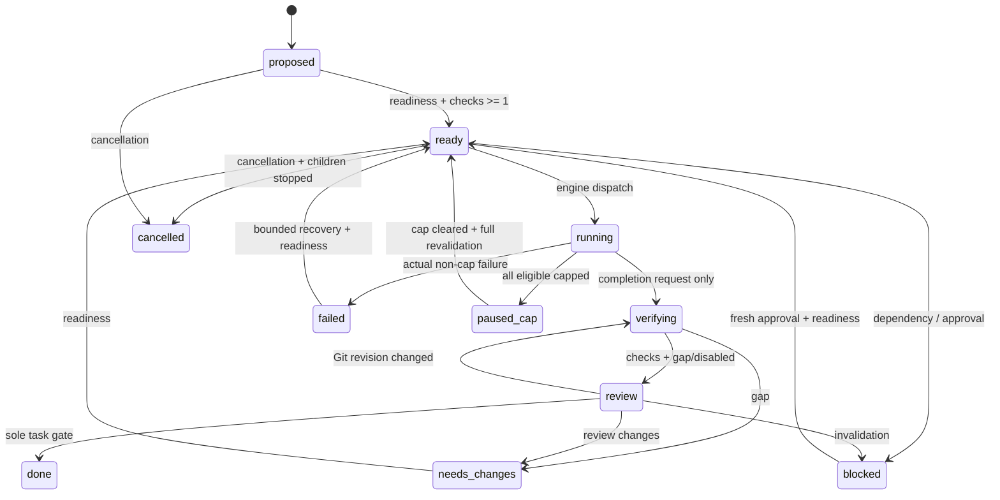

# KorWF task and phase state machine

**Status:** Stage 1 contract, issue #13; **implemented at runtime by issue #41**. **Authority:** PLAN §5, §2.3–2.6,
§3.C, §3.D, §3.F and §7. The data counterpart is
[`src/workflow/transitions.ts`](../src/workflow/transitions.ts); record vocabulary is
[`records.md`](records.md). #14 refines gate formulas, #15 approval classes, and #23
persistence.

### Runtime implementation (#41)

The engine that applies this specification is:

| Module | Responsibility |
|---|---|
| [`src/workflow/state.ts`](../src/workflow/state.ts) | `transitionTask` / `transitionPhase` — the **only** writers of `Task.status` and `Phase.gateStatus`. Conjunctive fail-closed guard evaluation, actor authorisation, snapshot freshness, evidence presence, gating substages, and one `transition_event` row for every accepted **and** rejected request. |
| [`src/workflow/blockers.ts`](../src/workflow/blockers.ts) | Blockers as records. `blocked` is derived from unresolved rows; resolving the last one does not grant readiness. |
| [`src/workflow/invalidation.ts`](../src/workflow/invalidation.ts) | §5 applied: each enumerated event → its task/phase state effect, plus task-revision bumping and evidence exclusion. |
| [`src/workflow/scope-change.ts`](../src/workflow/scope-change.ts) | §3.C: an inert proposal, persisted only against an explicit, unspent, user-granted approval naming its digest. |
| `transition_event` and `blocker` tables | `src/storage/migrations/0005-transitions.sql`, wrapped by `src/storage/transition-log.ts`. Both refuse UPDATE/DELETE by SQL trigger. |

Three properties the runtime adds to the data contract:

- **Guards fail closed in four shapes.** An absent evaluator, `false`,
  `"unknown"` and a thrown error are all failures, and every failing guard id
  is reported at once. `taskDoneGuards({})` therefore makes `done`
  unreachable: the gate formulas are Stage 4, and until they exist the hook
  rejects rather than assumes.
- **Structural guards cannot be waived.** `checks_registered`,
  `readiness_valid` (dependencies done, no unresolved blocker) and
  `blocker_present` are computed from the store and combined with the
  caller's table by conjunction, so a caller supplying `() => true` for one
  of them does not change the outcome.
- **A rejection is persisted even though nothing else is.** The event is
  built inside the evaluating transaction and appended in a fresh one after
  that transaction rolls back, so a refusal leaves exactly one row — the
  audit of the refusal — and no mutation of task, phase, approval or attempt.

## 1. Interpretation and ownership

Each table row names an allowed `(from, trigger, to)` edge. A list of source states
means one edge per source. All listed preconditions are **AND**, not alternatives.
Guard identifiers resolve to the full predicates in `PRECONDITIONS`; missing or
unknown results fail closed. Required evidence is independently captured and checked
by the engine, not supplied as a trusted boolean by the caller.

- **E** = `engine_only`; **U** = `user` request; **W** =
  `worker_request_then_engine`. The engine alone commits **every** transition.
  A worker cannot impersonate an engine trigger or assign status.
- New tasks start `proposed`; new phases start `pending`. Imports, recovery, tools,
  UI, direct patches and user requests cannot initialize or set success states.
- Every accepted transition atomically records source, destination, trigger, actor,
  timestamp, task/plan/Git revisions, mode/policy, evidence references and effects
  under the single writer. Recheck all guards against the current snapshot before
  commit; stale requests are rejected. External dispatch follows durable permission.
- `T*` = all **nonterminal** tasks: proposed, ready, running, verifying, review,
  blocked, failed, needs_changes, paused_cap. `P*` = pending, running, gating,
  paused, failed. Self-edges are permitted only where explicitly listed.
- `done` and `cancelled` are terminal, with **no outgoing transitions**. A later
  change does not rewrite a historical completion. New follow-up work needs explicit
  scope approval and new tasks; a finished phase needs a new approved follow-up phase.
  A failed phase may recover without reopening already-done tasks. Their historical
  receipts alone never establish correctness of a newer merged result.

### State vocabulary

Tasks use `TaskStatus` verbatim; `paused_cap` is the spelling of PLAN's `paused(cap)`.
The requested phase lifecycle projects onto #12's more detailed `PhaseGateStatus`:

| Lifecycle | Persisted gate status | Meaning |
|---|---|---|
| pending | pending | Approved run has not started (or recovery awaits revalidation). |
| running | running | Dependency-aware scheduling active. |
| gating | integrating → verifying → review | Sole-owner integration, merged checks, then policy review. |
| done | passed | Phase gate passed; immutable completion report. |
| paused | paused_cap / paused_approval | Resumable stop, with explicit reason(s) and saved substage. |
| failed | failed | Actual execution/integration/check failure or failed phase review/gap. |
| cancelled | cancelled | Dispatch and children stopped; partial result retained, not success. |

`paused_approval` is an additive Stage 1 record literal for non-cap stops (including
manual pause); it is not a new success path. Budget stops use `paused_cap` with a
**budget** reason, not `all_candidates_capped`. Stage 3/#23 must persist reason(s),
saved task/phase substage, handoff references and gate receipts; current #12 records
are not a complete runtime store. The projection is not permission to skip gating
substages. Integration failure uses `phase-failed`; review/gap changes use `phase-gap`;
a changed merged SHA returns the substage to verifying.

## 2. Readiness and completion guards (non-waivable)

### READY

Every edge into `ready`, including recovery and cap resume, explicitly includes:

1. `checks_registered`: **Task.checks.length ≥ 1**, each an executable command,
   assertion, lint/type check or an explicitly required human check (PLAN §2.3).
2. `readiness_valid`: current schema, criterion coverage, acyclic dependencies,
   all dependencies done, approved scope, no unresolved blocker, schedulable ownership.
3. `authorization_current`: valid approvals for current action, revisions, mode,
   policy and scope; not expired/revoked. High-risk actions require explicit approval
   in every mode. Approval is not inferred from Jev confidence.

Dispatch rechecks READY plus `dispatch_allowed` (parent running, eligible available
model, allowlist/pin/capability, budget, concurrency and ownership reservations).
`recovery_authorized` means bounded, within approved scope/budget, with uncertain
external effects reconciled; for first readiness it records that no retry is needed.

### TASK_DONE

Only **`task-done`: review → done, E, task_gate_passed** may set task success:

```
checks_registered
AND all_checks_pass_exact_revision
AND no_jev_gap_or_disabled
AND policy_review_satisfied
```

- **All** registered checks pass at both current `Task.revision` and the exact Git
  SHA being certified. Commands must exit **0**; `expectedExitCode` cannot redefine
  success to a nonzero exit. Explicit human checks need passing, attributable human
  evidence at that revision. `required=false` does not exempt a registered check.
  Missing, flaky, unavailable, signalled, timed-out and stale results are not success.
- Fresh Jev evidence-gap assessment must find support for **every** acceptance
  criterion and that tests exercise the requirement, **or Jev is disabled**. No-key
  mode records disabled optional assistance and a deterministic criterion-to-check/
  evidence coverage assessment; checks and policy review are unchanged. An error,
  timeout, missing assessment or unknown answer is **not** no-gap. Unavailability may
  enter the documented disabled fallback with an explicit record, never a fabricated
  assessment. Disabling Jev does not satisfy any failing check or required review.
- All current policy-required independent model reviews and high-risk human approvals
  pass at the same task/plan/policy and exact Git revision. If policy requires none,
  record that policy evaluation rather than silently skipping the stage.

The entire conjunction is rechecked on commit, even if verifying → review passed
previously. A check invalidated after a later edit must be rerun. A worker completion
claim, a user “mark done”, a Jev score, a tool patch or a resumed conversation cannot
substitute for this gate. Integration uses a sole owner; a changed integration SHA
cannot borrow task evidence from the pre-merge SHA. Phase merged-result verification
is an additional gate, not a rewrite of task history.

### PHASE_DONE

Only **`phase-done`: gating → done, E, phase_gate_passed** may persist `passed`:

```
all_tasks_done
AND integrated_checks_pass_exact_revision
AND phase_no_jev_gap_or_disabled
AND phase_policy_review_satisfied
```

Every current phase task must be done (not cancelled/failed/blocked). All integrated
checks pass on the **exact merged SHA**, under the sole integration owner, using
current plan/task receipts. Phase gap assessment covers phase criteria and accumulated
evidence, with the same explicit disabled/no-key fallback rules. Required phase model
review and high-risk human approval must pass for that merged SHA and current plan,
mode and policy. A report records built scope, evidence, open questions and cost.
No later phase starts merely because workers exited successfully.

## 3. Task transition table

Guard bundles READY and TASK_DONE mean the full conjunctions above. Remaining guard
ids below have their precise definitions in `PRECONDITIONS`, not discretionary prose.
Every row also follows the common commit/audit rules in §1.

| ID; from → to | Trigger; actors | Preconditions | Required evidence | Side effects |
|---|---|---|---|---|
| task-ready; proposed, blocked, failed, needs_changes → ready | readiness_validated; E | READY; recovery_authorized | Current checks/coverage; dependency/schema validation; approval and recovery decision | Clear resolved blocker; queue only, no worker yet. |
| task-dispatch; ready → running | dispatch; E | READY; dispatch_allowed | Authorization/model selection; budget/ownership reservation; attempt contract | Create attempt/worktree binding; record and surface model/fallback. |
| task-submit; running → verifying | completion_requested; E,W | attempt_settled | Artifacts, claim, task revision and exact SHA | Schedule all checks; claim is not passing evidence. |
| task-review; verifying → review | checks_and_gap_assessed; E | checks_registered; all_checks_pass_exact_revision; no_jev_gap_or_disabled | Current per-check results, coverage, gap or disabled decision | Request independent review/human approvals by policy. |
| task-done; review → done | task_gate_passed; E | TASK_DONE | Exact-revision checks, criterion mapping/gap or disabled fallback, policy result and approvals | Atomically persist gate receipt/completion revision; release ownership; report evidence. |
| task-failed; running, verifying, review → failed | non_cap_failure; E,W | failure_observed | Categorized actual failure and bounded next steps | Reconcile/stop attempt; retain artifacts and evidence; release reservations. |
| task-changes; verifying, review → needs_changes | gap_or_review_changes; E | changes_required | Gap/review findings with criterion ids | Retain failed gate; request bounded remediation, no scope expansion. |
| task-block; T* → blocked | blocker_or_user_pause; E,U,W | blocker_present | Dependency/permission/information/pause reason and disposition | Halt affected action at safe boundary; queue or notify; preserve artifacts. |
| task-invalidate; T* → blocked | approval_invalidated; E | invalidation_applies | Event, approval ids, current revisions/mode/policy | Atomically invalidate with source change; stop affected action; apply §5 phase disposition. |
| task-replan; T* → proposed | user_replan; U | user_revision_requested | Authorized diff and counters | Stop/reconcile affected attempts; bump task/plan revision per records.md; apply invalidation before dispatch (affected tasks end blocked); require readiness again. |
| task-stale-evidence; verifying, review → verifying | git_revision_changed; E | revision_changed | Old/new SHA, affected evidence ids | Retain but exclude stale checks/decisions/reviews; rerun. |
| task-cap; ready, running, verifying, review → paused_cap | all_candidates_capped; E | all_eligible_models_capped | Nonempty eligible set, availability/reset per candidate, saved stage/handoff | Pause parent atomically; settle attempt paused_cap, not failed; retain worktree and surface state. |
| task-cap-resume; paused_cap → ready | eligible_cap_cleared; E | READY; cap_resume_valid; recovery_authorized | Updated availability, fresh validation, reconciled handoff/stage | Parent only resumes through phase-cap-resume; new attempt continues saved stage or authorized restart; never skip checks/review. |
| task-cancel; T* → cancelled | cancel; U,E | cancellation_requested | User request/pre-approved rule, child termination and effect reconciliation | Stop dispatch/children; invalidate outstanding action approvals; preserve worktrees/user changes; record partial result. |

Cancellation, revision changes, missing information and cap events do not create an
unlisted edge. A cancellation request first prevents further dispatch; `cancelled`
is committed only after children are stopped and uncertain effects reconciled. Failed,
blocked and needs_changes can re-enter readiness only with all guards; there is no
retry → running shortcut. A worker may **request** failure/block/submission, not decide
that the request satisfies a guard.

## 4. Phase transition table

| ID; from → to | Trigger; actors | Preconditions | Required evidence | Side effects |
|---|---|---|---|---|
| phase-start; pending → running | run; U,E | phase_start_valid; authorization_current | Approved plan/run or approved run-all continuation, cost estimate, budget and preceding gates | Reserve budget; schedule ready tasks. |
| phase-gate; running → gating | tasks_completed; E | all_tasks_done; authorization_current | Current task receipts, sole integration owner, merged revision | Integrate → verify merged checks → review; persist substage. |
| phase-done; gating → done | phase_gate_passed; E | PHASE_DONE | Task receipts, exact merged checks, phase gap/disabled coverage, policy review/approvals | Persist passed/report; next phase must use phase-start. |
| phase-failed; running, gating → failed | phase_failure; E | failure_observed | Actual execution/integration/check failure, recovery options | Stop dispatch, retain completions/artifacts; do not advance. |
| phase-gap; gating → failed | phase_gap_or_review_changes; E | changes_required | Phase gap or review findings | Retain failed gate; propose approved remediation; never reopen terminal tasks. |
| phase-recover; failed → pending | recovery_approved; U,E | recovery_authorized; authorization_current | Bounded plan, reconciled effects | Explicit scope approval for replan; invalidate changed approvals; rerun full phase gate. |
| phase-cap; running, gating → paused | all_candidates_capped; E | all_eligible_models_capped | Blocking task/reviewer eligible set, availability/reset, saved stage and handoffs | Persist paused_cap/all_candidates_capped; task-cap for affected task; quiesce others; notify, not failure. |
| phase-cap-resume; paused → running | eligible_cap_cleared; E | cap_resume_valid; authorization_current; recovery_authorized | Original all_candidates_capped reason, updated availability, full validation and reconciliation | Restore scheduling/handoffs; if tasks done, use phase-gate again, never jump to done. |
| phase-pause; P* → paused | phase_stop; E,U | phase_stop_present | Cap/budget/manual/inadequate substitute/pin/approval reason, saved stage and usage | Stop dispatch/quiesce children; persist reason(s), budget/cap as paused_cap, otherwise paused_approval; never auto-increase budget. |
| phase-invalidate; P* → paused | approval_invalidated; E | invalidation_applies; stop_phase_required | Event/affected approvals and stop disposition | Persist paused_approval, stop affected children/dispatch; retain all pause reasons. |
| phase-resume; paused → pending | user_resume; U | manual_resume_valid; authorization_current | Explicit request, fresh approvals, resolved reasons and reconciliation | Revalidate via phase-start; never replay completed work. |
| phase-stale-evidence; gating → gating | git_revision_changed; E | revision_changed | Old/new merged SHA and affected evidence | Return storage substage to verifying; rerun integrated checks and review. |
| phase-cancel; P* → cancelled | cancel; U,E | cancellation_requested | Request/pre-approved rule, termination/reconciliation | Cancel nonterminal tasks; preserve done tasks, worktrees and partial report; no success advance. |

`phase_start_valid` allows either schedulable work or already-done tasks needing an
integrated-gate retry. Thus `failed → pending → running → gating` remains available
when all tasks are done but the previous merged check failed; no terminal task is
reopened and no gate is waived.

### 4.1 `paused(cap)` and automatic recovery

The eligible candidate set is filtered by configured allowlist, capabilities, user
pins and policy **before** cap exclusion. It must be nonempty; zero candidates is a
configuration/permission blocker, not “all capped” by vacuous truth. If another
adequate candidate remains, select/fallback within current budget and policy (static
ordering when Jev unavailable), record and surface the switch; do not take the
all-capped edge. Pins are never silently overridden. If no adequate substitute exists,
pause with that distinct reason rather than degrading silently.

On all-capped, pause the affected task and its parent phase atomically; stop phase
dispatch, quiesce other workers safely, retain intact worktrees, artifacts, saved stage
and explicit handoff. Record cap kind, detection, estimated reset (possibly unknown)
and last availability observation. Status/notifications explain the pause and next
opportunity. **It is not a failed task/phase and must not consume a failure retry.**

Auto-resume is allowed **only** for a recorded `all_candidates_capped` pause when at
least one formerly capped eligible model becomes available and *all* readiness,
revision, approval, dependency, budget, pin, ownership and cancellation checks pass.
A reset timer is a reason to re-evaluate availability under the bounded reset/probe
policy, not proof of success; no busy polling or speculative paid calls. Unknown reset
waits for an availability update or explicit user resume. A cap clearing cannot clear
another unresolved reason (approval, manual pause, budget hard stop, cancellation).
No budget or permission is enlarged automatically.

Resume task to **ready**, not running/done; phase to **running**, with dispatch still
subject to normal guards. Reconcile previous children before spawning a new attempt.
Continue the saved implementation/verifier/reviewer stage using an explicit handoff,
or restart only when task-kind policy authorizes it and side effects are reconciled.
An already-finished task is not rerun to resume phase gating. All task/phase gates are
re-entered normally. Retain the fallback for the remainder of the current task (minimum
dwell); retry the primary at the next task boundary after estimated recovery, not by
oscillating or re-probing at every task. Every switch is recorded on Attempt and visible.

## 5. Approval invalidation: events → state effects

`APPROVAL_INVALIDATION_EVENTS` enumerates the five required events plus #12's existing
revoked/consumed/session-reconciled reasons. Every row identifies both the affected
approvals and task/phase disposition; these are not advisory labels.

| Event | Affected approvals | Task state effect | Phase state effect | Evidence consequence |
|---|---|---|---|---|
| task_revision_changed | Changed task and containing phase/plan approvals covering that content | Affected T* → blocked | Affected P* → paused | Exclude old task-revision evidence/decisions/review; retain originals. |
| plan_revision_changed | All workflow approvals pinned to old planRevision (scope/add/remove/reorder/reprioritisation) | Affected T* → blocked | Affected P* → paused | Reassess coverage and approvals; no stale gate decision reused. |
| expired | expiresAt ≤ now, checked on use/timer/reconciliation | Affected T* → blocked | By approval class below | Current exact checks may remain; require fresh approval/gate. |
| mode_changed | All workflow approvals on actual Workflow.mode change, including stricter mode | Affected T* → blocked | By approval class | Re-evaluate review/authorization in new mode. |
| policy_version_changed | All workflow approvals on Workflow.policyVersion change | Affected T* → blocked | By approval class | Re-evaluate under new user-approved policy; never self-weaken. |
| revoked | Approvals withdrawn by authorized actor | Affected T* → blocked | By approval class | Retain evidence; cannot use withdrawn permission. |
| session_reconciled | Approvals found stale against live repo/plan/effects on fork/resume | Affected T* → blocked | Affected P* → paused | Exclude stale evidence, reconcile abandoned attempts; no replay. |
| consumed | Single-use approval for an action already performed and recorded | Unchanged; repeated action request → blocked pending new approval | Unchanged; repeated request uses approval-class disposition | Preserve completed-action receipt; never replay the action. |

**Affected** means a task/phase whose *pending or executing action* depends on that
approval or changed content. Unrelated tasks retain state. Already blocked/paused
subjects stay so and accumulate the new reason. For `by_approval_class`:

- **Queue and continue**: task → blocked via `task-invalidate`; parent phase remains
  in its current state and other ready tasks may proceed. Notify and queue the request.
- **Stop the phase** (high-risk): task → blocked; phase → paused via
  `phase-invalidate`, stored as `paused_approval`; halt phase dispatch/affected children.
- **Auto-decide** cannot keep an invalid approval alive. Invalidate and block first;
  only a new permitted low-risk policy grant can resolve it through normal readiness.
  Until then use queue-and-continue. High-risk never auto-decides.

Terminal tasks/phases remain unchanged; invalidation cannot undo completed external
effects or reopen historical success. It still invalidates the approval, preventing
any new action from reusing it. New work requires new approval and new work records.

Source changes and `Approval.invalidation = {reason, at, detail}` are one transaction
with state effects; null → non-null only, never revived. Mode/policy changes invalidate
all affected workflow approvals in that transaction; the existing record helper reads
the stored invalidation, not an optional mode comparison. Revisions follow records.md:
task goal/criteria/check edits bump task revision; plan scope/order edits bump plan
revision. A request to replan may use `task-replan`, but mandatory invalidation completes
before dispatch, leaving affected nonterminal tasks blocked and phases paused until
fresh approval/readiness. No scope expansion is inferred from a model suggestion.

Cancellation disables dispatch first. Invalidation and outstanding pause reasons take
precedence over readiness/cap recovery in the same scheduling turn. Checks/reviews stay
as immutable evidence, but obsolete entries cannot count toward a current gate. User
approval alone never sets done; review and checks must still satisfy §2.

## 6. Illegal transitions: reject + audit

`ILLEGAL_TRANSITION_POLICY` is data for the future engine. Reject unknown states or
triggers, unlisted edges, unauthorized actors, false/missing/unknown guards, absent or
stale evidence, direct status patches, terminal mutations and stale concurrent snapshots.
No coercion into a “similar” edge; no mutation of task/phase/attempt/approval, no worker
spawn, no external action. An error is not a transition to done or failed.

Append an immutable **rejection event** containing subject kind/id, from/requested-to,
trigger, request actor and engine identity, timestamp, task/plan/Git revisions,
mode/policy, failed guard ids, sanitized evidence references, unchanged before/after
hash and reason code. Do not log raw private payloads or credentials. If audit storage
fails, fail closed and surface the storage error. #23 will specify the rejection-event
schema; #12's ordinary row-update audit must not be abused to pretend a rejected row
was updated. This issue does not implement persistence or runtime transition logic.

## 7. Mermaid overview

The tables above are exhaustive; diagrams show principal paths and shared exits.
`T*`/`P*` edges (block, pause, invalidation and cancellation) apply exactly as listed,
not as implicit permission from every state including terminals.

```mermaid
stateDiagram-v2
    [*] --> pending
    pending --> running: approved run
    running --> gating: all tasks done
    gating --> done: sole phase gate
    running --> failed: actual failure
    gating --> failed: check / gap / review failure
    failed --> pending: approved bounded recovery
    running --> paused: all capped / phase stop
    gating --> paused: all capped / approval invalidated
    paused --> running: cap clear + full revalidation
    paused --> pending: explicit user resume
    gating --> gating: changed merged SHA; reverify
    pending --> cancelled: cancel
    running --> cancelled: cancel + children stopped
```





## 8. Verification and limits

- `npm test -- workflow/state` — the **runtime** suites added by #41:
  `test/unit/workflow/state.test.ts` (table-driven over every ordered pair of
  task and of phase states; `done` unreachable without the gate hooks),
  `state-blockers.test.ts`, `state-invalidation.test.ts` (walks
  `APPROVAL_INVALIDATION_EVENTS`, so a new event fails the suite until it is
  handled) and `state-scope-change.test.ts`.
- `test -f docs/state-machine.md && test -f src/workflow/transitions.ts`
- `node --test test/workflow/transitions.test.mjs` — offline structural contract tests:
  all ready edges, unique engine-only success edges and gate conjunctions, outgoing
  coverage, invalidation mapping, cap resume, reject/audit, and documentation/table parity.
- `test/workflow/transitions.types.test.ts` — compile-time exhaustiveness against #12's
  status/reason unions (run with a local TypeScript compiler, no network install).

The `test/workflow/` suites verify **the specification data**; the `test/unit/workflow/state*`
suites verify the runtime enforcement of it. No live model or TypeSafe calls are made by
either. Still outstanding after #41: the gate *formulas* behind
`all_checks_pass_exact_revision`, `no_jev_gap_or_disabled` and
`policy_review_satisfied` (Stage 4, #46–#49) — until they are supplied the hook rejects,
so `done` is unreachable rather than assumed — and the scheduler that decides which
ready task to dispatch (Stage 6). TypeScript readonly fields alone are not a security
boundary: the enforcement above is by guard evaluation and SQL trigger, and the
adversarial route tests belong with the tool and worker mutation paths.
